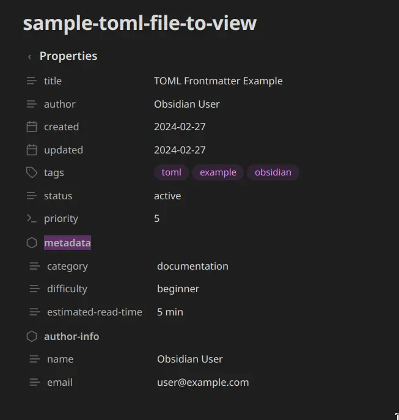

# TOML Frontmatter Processor

An Obsidian plugin that renders **TOML frontmatter** (`+++...+++`) as a native-style Properties panel in both Reading view and Live Preview.

<p align="center">
  
</p>

```toml
+++
title = "TOML Frontmatter Example"
author = "Obsidian User"
created = 2024-02-27
updated = 2024-02-27
tags = ["toml", "example", "obsidian"]
status = "active"
priority = 5

[metadata]
category = "documentation"
difficulty = "beginner"
estimated-read-time = "5 min"

[author-info]
name = "Obsidian User"
email = "user@example.com"
+++
```

## Features

- **Properties UI** — renders TOML data like Obsidian's native Properties panel with type-aware icons
- **Reading view + Live Preview** — works in both modes, independently toggleable
- **Type detection** — dates get calendar icons, arrays render as tag pills, booleans as checkboxes
- **Nested tables** — TOML sections (`[metadata]`) display as collapsible sub-sections
- **Cursor-aware** — in Live Preview, click into the frontmatter to edit raw TOML; click away to see the widget
- **YAML-safe** — ignores files with standard YAML frontmatter (`---...---`)
- **Error display** — malformed TOML shows parse errors inline without breaking the note
- **Configurable** — custom delimiter, render mode, collapse state, per-view toggles

## Installation

### From Community Plugins (coming soon)

1. Open Obsidian Settings > Community plugins
2. Search for "TOML Frontmatter Processor"
3. Install and enable

### Manual

1. Download `main.js`, `manifest.json`, and `styles.css` from the latest release
2. Create `<vault>/.obsidian/plugins/md-processor-toml/`
3. Copy the three files into that directory
4. Enable the plugin in Settings > Community plugins

## Settings

| Setting | Default | Description |
|---------|---------|-------------|
| Delimiter | `+++` | Characters marking frontmatter boundaries |
| Default Collapsed | Off | Show Properties panel collapsed by default |
| Render Mode | Table | Table, Raw TOML, or Both |
| Enabled in Reading View | On | Show Properties in Reading view |
| Enabled in Live Preview | On | Show Properties in Live Preview / Edit mode |

## Development

```bash
npm install
npm run build
npm test

# Build + install to vault
npm run install-plugin
```

## How it works

- **Reading view**: Markdown post-processor detects TOML sections and replaces them with the Properties widget
- **Live Preview**: CodeMirror 6 StateField provides block-level decorations that replace the `+++...+++` range
- **Parsing**: Uses `@iarna/toml` for spec-compliant TOML parsing with in-memory caching
- **YAML coexistence**: Only activates when the first non-empty line is exactly the delimiter (`+++`)

## License

MIT
